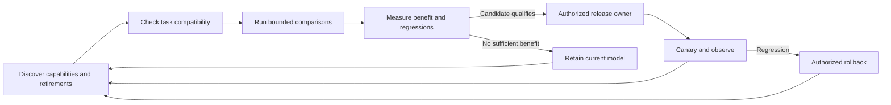

# Product diligence: model evolution enhancement

Updated and installed on **2026-09-19**. The existing `product-diligence` now
assesses whether a product can convert newer AI capabilities into measured user
benefit. It preserves the original six executive lenses and adds an executable
model-evolution evidence gate. It does not promise permanent relevance or turn an
assessment skill into an active product deployment service.

## What changed

| Area | New behavior |
| --- | --- |
| Model evolution | Eight evidence controls cover task/model identity, freshness/deprecation watch, evaluation, external policy enforcement, fallback/recovery, rollout/rollback, product outcomes and release authority. |
| Improvement decisions | Compare the incumbent and candidate on the same task, dataset, scorer and evaluation protocol. Require supported quality gain, or quality noninferiority with meaningful cost/latency gain, while all supplied safety, compatibility and operational limits pass. |
| Product opportunity review | Look for useful capabilities and simplifications: better workflows, multimodal journeys, cheaper routing, removal of obsolete prompt chains and model-specific workarounds. These are experiments, not automatic requirements. |
| Honest D6 verdict | Replaced broad “Future-resilient” with “Resilient within evaluated scope.” Control-strength labels alone cannot qualify. Missing evolution proof remains unknown; evidenced blockers retain their negative consequence. |
| Current evidence | Bind receipts to product, revision, environment, configuration, hashes and expiry. Verify actual local bytes. Separate review-model identity from the product's runtime model identity. |
| Safe reassessment | Changes to source, removed artifacts, model/configuration, rules/prompts or supplied assessment parameters invalidate prior review. Archive state, preserve finding IDs, revalidate and obtain a fresh challenge. |
| Portability | Rules, scripts and prompts resolve inside the package. Copies no longer accidentally depend on neighboring skill files. |

The intended product process is:



The skill specifies and checks evidence for this process. Real discovery jobs,
provider calls, budget enforcement, release execution and observation belong to
the product's configured runtime. `QUALIFIED` is review eligibility and always
includes `execution_authorized: false`. A working upgrade process can qualify
while every new candidate is rejected; retaining the incumbent may be correct.

## Current research used

The update follows task-specific, continuous evaluation principles in
[OpenAI's evaluation guidance](https://developers.openai.com/api/docs/guides/evaluation-best-practices).
It accounts for provider-specific version semantics described by
[Anthropic](https://platform.claude.com/docs/en/about-claude/models/model-ids-and-versions)
and stable versus moving model references described by
[Google](https://ai.google.dev/gemini-api/docs/models).

It also reviews APIs and hosted evaluation/orchestration services for retirement,
using [OpenAI's deprecation notices](https://developers.openai.com/api/docs/deprecations).
The package stores no permanent “best model” selection. Its
[nine-source baseline](../skill-packages/product-diligence/references/current-sources.md)
must be refreshed for each real upgrade decision.

## Verification and installation

- **60 package tests passed**, including actual file tampering, stale evidence,
  moving aliases, quality/cost/safety regressions, changed subjects, pending proof,
  copied-package operation, parameter changes and full CLI render/reassessment.
- Independent review exercised nine grouped adversarial cases and found a rerun
  defect that retained old assessment parameters. It was repaired and rechecked.
  See [the independent report](../output/diligence-independent-review.md).
- **16 authored files** installed into the three existing skill locations;
  **48 installed hashes** and all three skill validators passed. Originals are
  backed up. See [installation](../output/diligence-installation.json) and
  [validation](../output/diligence-final-validation.json).
- [The scoped Graphify refresh](../output/diligence-final-graph/GRAPH_REPORT.md)
  covers seven Python AST files and file/link provenance for the other nine files.
  It records 18 unresolved reference nodes and 25 collapsed endpoint pairs with
  raw edges preserved. This is partial structural coverage, not a complete audit.

No real product model was switched, no paid provider experiment was run, and no
recurring monitor or deployment was activated. Receipt validation cannot prove
the truth of a report or authenticate its author; substantive evaluation and
release authority remain separate. The retained acquisition/business rules were
not comprehensively re-audited by this change.

## Use it

```text
Use $product-diligence to assess [product/repository] for continuous model improvement.
Identify obsolete assumptions and useful new capabilities. Compare candidates
against product outcomes and hard constraints. Deliver the six-lens scorecard,
upgrade-readiness gaps, measured candidate decisions and the prioritized work
needed to make the improvement process operational.
```

The installed entrypoint is
[Product Deligence Loop V4/SKILL.md](</C:/Users/vijay/.codex/skills/Product Deligence Loop V4/SKILL.md>).
The [adaptive review method](../skill-packages/product-diligence/references/adaptive-method.md)
and [typed evidence contract](../skill-packages/product-diligence/references/evolution-contract.md)
describe the product integration requirements. Installation is verified on disk;
a task that already loaded the previous instructions may need to reload the skill.
