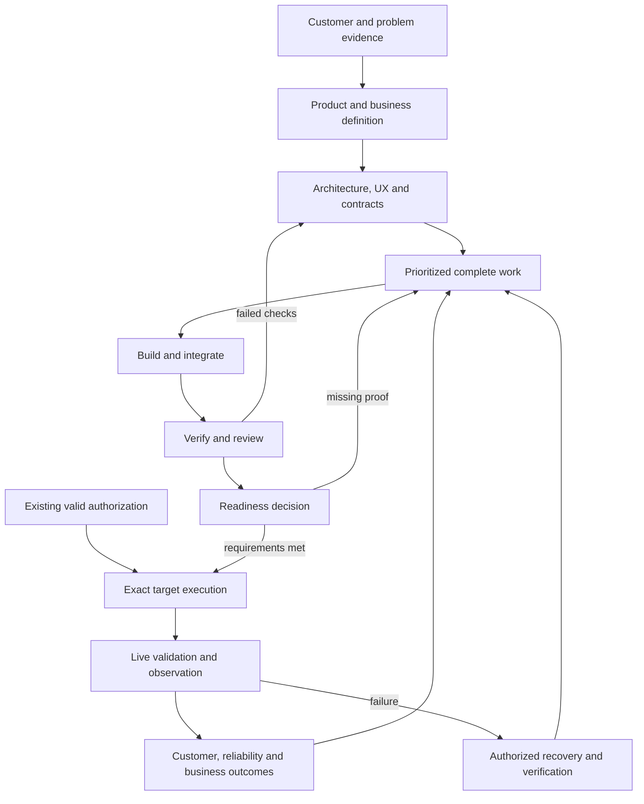

# Your unified product lifecycle loop

Created on 2026-09-12. The reusable entry point is **`$product-lifecycle-loop`**.
It is installed at
[the personal Codex skill](C:/Users/vijay/.codex/skills/product-lifecycle-loop/SKILL.md),
with the editable source in
[this workspace package](C:/Users/vijay/OneDrive/Documents/LoopsOS/skill-packages/product-lifecycle-loop/SKILL.md).
Installation fingerprints are recorded in
[the current seven-loop installation manifest](C:/Users/vijay/OneDrive/Documents/LoopsOS/output/seven-loop-installation.json).
Existing unrelated skills were preserved.

This is one Codex conductor that selects the relevant skills, coordinates their
work, and preserves evidence and authorization across the product lifecycle.
It includes skill-inventory code, a local progress ledger, a tested local scheduler,
help delivery, reviewed limits-only state migration, and business work procedures.
The [seven-loop enhancement report](SEVEN_LOOP_ENHANCEMENTS.md) records the current
controls, installed copies and validation. A product backend, merchant account,
hosted deployment controller and always-on monitor still require product setup.

## Use it

In the product's Codex task, invoke it with the outcome you want:

```text
Use $product-lifecycle-loop to pursue this full product goal: [your goal].
Preserve the accepted criteria, diagnose and repair failures, get precise help
when needed, revalidate and resume, and verify the final integrated outcome.
```

For a new idea, provide the idea and known audience. For an existing product,
provide the repository or product context and the desired result. You can ask for
review/plan only, implementation and testing, release preparation, operations,
or business work. The conductor preserves that scope. If the new skill is not
yet listed in the current task, start a new task or explicitly reference its
installed `SKILL.md` path; this session has verified installation, not host reload.

## The corrected shape



Security, privacy, accessibility, reliability, cost, and commercial constraints
apply throughout. The preferred delivery owner is `codex-product-build-loop`.
The older `product-loop` and `agentic-product-loop` remain alternative cycle
owners; they are not nested inside the new conductor. Specialists are selected
only when their capabilities apply.

The complete phase-to-skill mapping is in
[lifecycle-map.md](C:/Users/vijay/OneDrive/Documents/LoopsOS/skill-packages/product-lifecycle-loop/references/lifecycle-map.md).
The business layer covers pricing and customer hypotheses, billing/subscription
state, server-enforced entitlements, signed and idempotent webhooks, growth
experiments, lifecycle messaging, factual policy drafts, consent and rights
workflows. See
[business-playbooks.md](C:/Users/vijay/OneDrive/Documents/LoopsOS/skill-packages/product-lifecycle-loop/references/business-playbooks.md).

## What the skill review changed

The pre-install inventory found **166 distinct local skill names across 310
entrypoint files**. The plugin cache contributed 380 entrypoints; these include
older or inactive packages and are not all active capabilities. Across both,
690 entrypoints were read for metadata and hashed. Relevant bodies and release
scripts received deeper review; this was not a security certification of every
package.

Your map's 64 individual names/capabilities resolved to 43 in the supplied active
catalog, 7 on disk only, and 14 missing exact names. The report preserves every
requested name and identifies alternatives without equating them. It also found
69 local duplicate-name groups with differing content. The conductor records
exact paths and hashes instead of silently choosing a variant.

See the
[full skill review](C:/Users/vijay/OneDrive/Documents/LoopsOS/reports/PRODUCT_LIFECYCLE_SKILL_REVIEW.md)
and
[machine-readable inventory](C:/Users/vijay/OneDrive/Documents/LoopsOS/output/product-lifecycle-skill-inventory.json).
These counts describe the snapshot before installing the new skill.

## Release integration has a specific unresolved boundary

The source review found **11 compatibility findings** in the legacy release
ecosystem. Examples include a dry run emitting executed rollback evidence,
skipped smoke reaching success, failed rollback being reported as rolled back,
adapters restamping old evidence, and approval derived from a veto timeout.

The new conductor explicitly blocks automatic use of the affected helpers until
they are repaired and independently verified. It supports concrete release
preparation and an authorized, reviewed provider workflow when project policy
allows it. It does not label that as a mechanical legacy-governor GO. Valid
authorization already supplied is reused; readiness evidence cannot manufacture
new authority.

The findings and proposed remediation tests are in
[release compatibility review](C:/Users/vijay/OneDrive/Documents/LoopsOS/reports/PRODUCT_LIFECYCLE_RELEASE_COMPATIBILITY.md).
The original compatibility review inspected the scripts without execution. The
subsequent red-team review exercised four isolated governor functions; no legacy
CLI or effectful workflow was executed, and those scripts were not modified. An unattended
production pipeline remains unproven until those defects and the target
runtime/provider requirements are addressed.

## Recovery and individual-loop strengthening

The conductor now records mandatory goal criteria, acyclic task dependencies,
cumulative attempts, stable failure signatures, help responses and current
evidence. It can continue independent required work while another branch waits,
then revalidate and resume. Unknown external effects require reconciliation; an
already-applied effect proceeds to verification without duplicate execution.

The helper's `READY_FOR_GOAL_REVIEW` is a prompt for final integrated verification.
It is not goal completion, producer authentication or release authorization.
The local scheduler now dispatches real work with count/time reservations and
local inbox help delivery. Provider spending, external help transport and
always-on hosting remain separate integrations.

See [the red/blue assessment and implemented repairs](C:/Users/vijay/OneDrive/Documents/LoopsOS/reports/PRODUCT_LIFECYCLE_BLUE_TEAM.md)
and [the individual-loop strengthening plan](C:/Users/vijay/OneDrive/Documents/LoopsOS/reports/INDIVIDUAL_LOOP_STRENGTHENING_PLAN.md).
The latter preserves baseline recommendations. All seven coordinating loops have
since been enhanced and verified locally; [the current implementation report](SEVEN_LOOP_ENHANCEMENTS.md)
records 173 package tests, independent checks and remaining operational boundaries.
Specialists beyond those seven retain their proposed strengthening work.

## Baseline validation (before the recovery update)

- Codex's installed skill-creator validator: **PASS**.
- Inventory-helper unit suite: **14/14 PASS**, including duplicate drift,
  overlapping roots, malformed metadata, BOM, real symlinks, and CLI failures.
- Package references, JSON/YAML, metadata and unique evaluation IDs: **PASS**.
- Live resolver scan: the new package resolves; differing `product-loop` copies
  remain ambiguous; `supabase-architect` is found; `frontend-design` is missing
  from the scanned local roots. Four existing description fields are reported
  as unsupported metadata; the helper does not hide those limits.
- The baseline included ten behavioral scenarios and eight trigger cases for ongoing
  evaluation. Only separately recorded walkthroughs count as executed.
- Three recorded instruction-following walkthroughs completed successfully:
  rejecting unsupported live proof, preparing business work around unknown
  facts, and reusing valid staging authorization. See
  [evaluation notes](C:/Users/vijay/OneDrive/Documents/LoopsOS/output/product-lifecycle-forward-eval/EVALUATION_NOTES.md).
  These are simulations, not runtime enforcement or provider tests.
- Two additional cases passed in a fresh-context evaluator: reuse of valid exact
  staging authorization and rejection of dry-run proof plus approval for a
  different artifact. See
  [fresh-context responses](C:/Users/vijay/OneDrive/Documents/LoopsOS/output/product-lifecycle-fresh-forward-check.md).
- Scoped Graphify refresh: all 10 package files covered, 127 nodes and 198
  exported edges, no source hash drift or dangling endpoints. It is a supplement
  to the existing repository graph; one parallel import relation collapses in
  the graph export and remains preserved in raw extraction. See
  [graph report](C:/Users/vijay/OneDrive/Documents/LoopsOS/output/product-lifecycle-graph/GRAPH_REPORT.md).
- Baseline installation: all 10 files matched the source package by SHA256.

The earlier recovery package had 15 behavioral scenarios. Current helper tests,
independent red checks, graph refresh and installation validation are reported in
[the seven-loop enhancement report](SEVEN_LOOP_ENHANCEMENTS.md). Historical
baseline results do not certify the updated helpers or production operations.

The current work does not prove any product's production readiness, real payment
behavior, legally approved documents, or unattended recovery. Those outcomes
need their own current evidence in the product that uses this loop.
