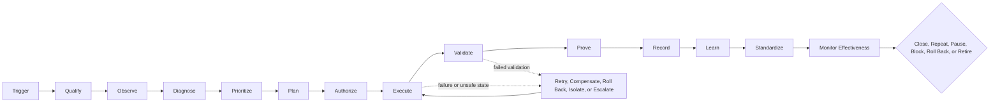

# Production-Grade Continuous Improvement Loop


## Contents

- [Purpose and use](#1-purpose)
- [Core principles and lifecycle](#3-core-principles)
- [Proof states and risk tiers](#6-proof-states-and-gate-rules)
- [Authority, scope, inputs, and metrics](#8-authority-and-composition)
- [Decision, execution, and recovery controls](#14-decision-design-and-prioritization)
- [Validation, evidence, and learning](#17-validation-and-test-oracle)
- [Conditional verdicts and oscillation control](#19-conditional-verdict-contract)
- [Canonical catalog and machine-readable contracts](#29-canonical-control-catalog)
- [Complete 109-control checklist](#complete-risk-tiered-control-checklist)
- [Implementation and completion criteria](#37-definition-of-done-for-a-loop-skill)

---

## 1. Purpose

This standard defines how to design, operate, verify, govern, and improve a continuous improvement loop for software delivery, operations, AI, generative AI, and agentic systems.

It is designed for a system of small, connected loops. Each loop owns one measurable outcome, consumes authoritative inputs, makes a bounded decision, acts through approved authorities, produces evidence, verifies the result, learns from failure, and changes or retires itself when its assumptions no longer hold.

This standard does not claim that any loop can be literally fail-proof. A loop is considered complete for its declared scope and risk tier only when it can:

1. Detect a relevant change, gap, or failure.
2. Confirm that it owns the concern.
3. Collect trustworthy evidence.
4. Diagnose the likely cause.
5. Prioritize the response.
6. Plan and authorize the action.
7. Execute safely within bounded authority.
8. Recover during execution when needed.
9. Validate immediate correctness.
10. Prove the required control through an executed probe.
11. Confirm sustained outcome improvement.
12. Preserve traceable evidence.
13. Convert learning into the operating baseline.
14. Detect drift, repeated reversals, and obsolescence.
15. Pause, block, roll back, or retire when continuation is unsafe or no longer useful.

> A workflow ends when an action is completed. A production-grade loop ends only when the required control is proven, the intended outcome is confirmed, guardrails remain intact, learning is incorporated, and no unresolved condition remains.

---

## 2. How to Use This Standard

Use this document as a **coverage audit and proof standard** over an existing product-loop architecture.

It should not replace:

- The authority hierarchy
- The composition map
- Gate rules
- The durable state register
- Defaults and invariants
- Existing owner skills
- Existing release, migration, evaluation, tool-contract, security, or governance skills

The checklist in this document identifies concerns that a production-grade loop may need. It does not assign all concerns to one skill. Each concern must map to exactly one authoritative owner.

Examples of separated ownership include:

| Concern | Authoritative owner pattern | Orchestrating loop responsibility |
|---|---|---|
| Release verdict | Release governor | Request and consume the verdict |
| Versioning and promotion | Release or promotion skill | Reference the approved version and promotion record |
| Schema migration rollback | Migration-safety skill | Require current green rollback proof |
| Baseline, target, and evaluation metrics | Product-evaluation skill | Consume approved definitions and results |
| Idempotency, timeout, and retry taxonomy | Tool-contract skill | Reference the contract and executed probes |

If an authoritative owner cannot be identified, the control is **UNMAPPED**. It must not be treated as implicitly covered.

---

## 3. Core Principles

### 3.1 One loop, one measurable outcome

Each loop must own one primary outcome. It may monitor guardrails, but it should not claim broad ownership of unrelated outcomes.

### 3.2 One authoritative owner per concern

A concern may have multiple executors and validators, but only one policy authority and one gate authority. Duplicate ownership creates forked authority, conflicting thresholds, and inconsistent evidence.

### 3.3 Declared is not proven

A document, configuration, design, or code path may declare that a capability exists. A gate that requires executable behavior is satisfied only after the required probe runs green for the correct scope.

Examples:

- A rollback plan is not rollback proof.
- An idempotency key is not replay proof.
- A fallback model configuration is not failover proof.
- A kill switch design is not containment proof.
- A reproducibility statement is not a reproduction run.
- A retention policy is not deletion proof.
- A test oracle is not validation until output is compared against it.

### 3.4 Action applied is not outcome proven

A change can execute successfully and still fail to improve the intended outcome. Record these as separate states:

- Action applied
- Immediate validation passed
- Control proven
- Effectiveness pending
- Effectiveness proven
- Sustained improvement confirmed

### 3.5 Risk controls the depth of proof

The required controls, approvals, test depth, evidence retention, and independence must scale with the actual execution risk.

### 3.6 Recovery is part of execution

Retry, timeout, compensation, rollback, containment, and safe-stop behavior must be available while each state-changing step runs. Recovery is not only a final stage after validation.

### 3.7 Conditional decisions must expire

A conditional verdict must have a named owner, bounded exposure, evidence floor, deadline, and explicit terminal outcomes. Missing evidence at expiry is a failure, not an implied pass.

### 3.8 Every successful correction changes the baseline

Learning must update a durable destination such as a test, evaluation case, prompt, policy, runbook, default, standard, metric, architecture rule, or backlog item.

### 3.9 Every loop must detect oscillation

A loop must detect repeated reversals of the same decision. It must use hysteresis, a minimum dwell period, a materiality floor, or an escalation rule when reversals exceed the permitted limit.

### 3.10 Evidence must be scope-bound and current

Proof must identify the exact product, component, release, environment, data class, model, prompt, schema, configuration, probe version, and execution time to which it applies.

---

## 4. Production-Grade Loop Sequence

The conceptual lifecycle is:



### 4.1 Stage definitions

| Stage | Required behavior |
|---|---|
| **Trigger** | Detect the event, schedule, threshold, request, failure, or material change that starts the loop. |
| **Qualify** | Confirm applicability, ownership, input sufficiency, authorization, risk tier, and absence of duplicate handling. |
| **Observe** | Collect current-state data from authoritative sources with required freshness and lineage. |
| **Diagnose** | Identify symptoms, immediate cause, contributing factors, failed controls, and likely systemic cause. |
| **Prioritize** | Rank findings by value, impact, urgency, probability, confidence, cost of delay, effort, and dependency complexity. |
| **Plan** | Define actions, sequence, owner, expected result, validation, resource limits, recovery, and communication. |
| **Authorize** | Apply the authoritative automated gate or obtain the required human approval. |
| **Execute** | Apply approved actions with preconditions, idempotency, timeout, budget, concurrency, and recovery controls. |
| **Validate** | Confirm immediate correctness, expected state transition, non-regression, and absence of unacceptable side effects. |
| **Prove** | Run the required drill, probe, evaluation, replay, fault injection, canary, or observation and compare with acceptance thresholds. |
| **Record** | Persist decisions, evidence, versions, approvals, actions, failures, and results in authoritative locations. |
| **Learn** | Convert the outcome into tests, evaluation cases, policies, prompts, standards, defaults, or backlog actions. |
| **Standardize** | Incorporate successful corrections into the approved operating baseline. |
| **Monitor effectiveness** | Confirm that the intended result occurred and remained effective for the required period. |
| **Close or continue** | Repeat, pause, block, roll back, accept authorized residual risk, or retire the loop. |

---

## 5. Durable State and Lifecycle Events

Do not introduce a competing universal state field when the product already has a durable state register. Record lifecycle events and verdicts in the existing artifacts, such as:

- `LOOP_LOG`
- `METRICS.md`
- `verdicts/`
- `GOVERNANCE.md`
- Release records
- Evaluation records
- Audit evidence
- Owner-specific state files

The state mechanism must be able to represent these distinctions:

```text
TRIGGERED
QUALIFIED
OBSERVED
DIAGNOSED
PRIORITIZED
PLANNED
AUTHORIZED
ACTION_IN_PROGRESS
ACTION_APPLIED
VALIDATION_PASSED
VALIDATION_FAILED
PROOF_GREEN
PROOF_FAILED
EFFECTIVENESS_PENDING
EFFECTIVENESS_PROVEN
EFFECTIVENESS_FAILED
INSUFFICIENT_EVIDENCE
CONDITIONAL_ACTIVE
CONDITIONAL_EXPIRED
BLOCKED
ROLLED_BACK
PAUSED
RETIRED
```

The critical invariant is:

> `ACTION_APPLIED` is never equivalent to `EFFECTIVENESS_PROVEN`.

---

## 6. Proof States and Gate Rules

### 6.1 Proof-state model

| Proof state | Meaning | Gate eligible |
|---|---|---:|
| **UNMAPPED** | No authoritative owner or evidence source has been identified. | No |
| **DECLARED** | A document, policy, schema, or skill says the capability exists. | No |
| **IMPLEMENTED** | Code, configuration, infrastructure, or workflow appears to implement the capability. | Only when static existence is the complete requirement |
| **EXERCISED** | The required probe or drill executed, regardless of result. | No |
| **PROVEN** | The required probe ran green under the required scope and acceptance criteria. | Yes, while current |
| **SUSTAINED** | The control remained effective across the required observation period or repeated executions. | Yes |
| **FAILED** | The executed probe failed its acceptance criteria. | No |
| **EXPIRED** | Earlier proof is no longer valid for the current time, version, environment, or scope. | No |

### 6.2 Gate rules

1. **No proof, no pass.**
2. **Expired proof is equivalent to missing proof.**
3. **Scope-mismatched proof is not reusable.**
4. **Rollback and containment remain available even when forward progression is blocked.**
5. **A safety or security failure overrides normal promotion or observation windows.**
6. **An exception does not erase a failed control. It records an authorized temporary deviation.**
7. **A conditional verdict cannot auto-renew or silently become a pass.**
8. **A material owner conflict blocks high-risk progression.**
9. **A gate must consume evidence from the authoritative owner, not a copied summary.**
10. **A control that can be executed must not be accepted through declaration alone.**

### 6.3 Proof scope

Every proof record must bind to the relevant subset of:

- Product or service
- Component or workflow
- Release or build
- Environment
- Data class
- Risk tier
- Configuration
- Model and provider
- Prompt and evaluation version
- Tool and contract version
- Schema or migration version
- Probe version
- Acceptance threshold
- Execution date
- Evidence retention period

---

## 7. Risk-Tiered Applicability

### 7.1 Risk tiers

| Tier | Description | Typical examples |
|---|---|---|
| **R0: Experimental** | Local, disposable, no production access, no sensitive data, and no persistent external effect. | Local analysis script, throwaway prototype |
| **R1: Low** | Internal, limited impact, reversible, and no consequential production action. | Internal reporting automation, non-sensitive test workflow |
| **R2: Moderate** | Production or user-facing behavior with reversible effects and controlled blast radius. | Standard production release, customer feature, model response |
| **R3: High** | Sensitive data, privileged tools, regulated workflow, external communication, material customer impact, or consequential action. | PII processing, agent write action, access change |
| **R4: Critical** | Irreversible, safety-critical, legally binding, financially consequential, cross-tenant, infrastructure-wide, or catastrophic-loss potential. | Payment, destructive action, critical infrastructure, large-scale autonomous action |

### 7.2 Effective risk tier

Use the highest applicable tier across:

- Environment
- Data sensitivity
- User and customer impact
- External side effects
- Regulatory consequence
- Financial consequence
- Security privilege
- Reversibility
- Blast radius
- Agent autonomy
- Maximum possible loss

A normally low-risk skill becomes high risk when it receives production credentials, sensitive data, or irreversible authority.

### 7.3 Control inheritance

Higher tiers inherit the requirements of lower tiers.

| Minimum tier | Default control expectation |
|---|---|
| **R0+** | Identity, purpose, scope, trigger, input, output, owner, basic validation, execution limit, and stop condition |
| **R1+** | Versioning, dependencies, baseline, target, metrics, traceability, idempotency, retry taxonomy, evidence, and regression checks |
| **R2+** | Proven rollback, circuit breaker, non-regression, side-effect analysis, effectiveness window, monitoring, and expiring exceptions |
| **R3+** | Human approval, separation of duties, independent validation, privacy and compliance controls, kill switch, forensic evidence, and adversarial testing |
| **R4** | Dual control, catastrophic containment drill, maximum-loss bound, business continuity, independent authority, and sustained proof |

Each control record must include:

```yaml
minimum_risk_tier: R0 | R1 | R2 | R3 | R4
applies_when:
  - explicit applicability condition
```

---

## 8. Authority and Composition

### 8.1 Authority roles

| Role | Responsibility |
|---|---|
| **Policy owner** | Defines the authoritative rule and acceptance criteria |
| **Gate owner** | Makes or records the progression verdict |
| **Executor** | Performs the approved action |
| **Validator** | Independently verifies the required result where needed |
| **Business owner** | Owns the intended business outcome |
| **Technical owner** | Owns the implementation and operational integrity |
| **Risk owner** | Accepts residual risk when authorized |
| **Operator** | Runs the loop or responds to its findings |
| **Escalation authority** | Resolves blocked, conflicting, or critical conditions |

### 8.2 One-authority rule

For each concern, record:

- One policy owner
- One gate owner
- Zero or more executors
- One validator when independent verification is required
- One authoritative evidence location

The orchestrating loop may call owners and assemble references. It must not copy their decision logic, retry policy, evaluation formula, promotion threshold, rollback procedure, or retention rule into its own contract.

### 8.3 Authority conflict

A concern is blocked when:

- Two skills claim final authority for the same decision
- The gate consumes a non-authoritative copy
- The owner cannot be resolved
- The policy and gate owners use incompatible thresholds
- A downstream skill overrides the upstream authority without an explicit hierarchy rule

Use named failure states such as:

```text
UNMAPPED_AUTHORITY
OWNER_CONFLICT
FORKED_AUTHORITY
NON_AUTHORITATIVE_EVIDENCE
THRESHOLD_CONFLICT
```

---

## 9. Loop Identity, Purpose, and Boundaries

Every loop needs:

- Stable loop ID
- Unique name
- Category
- Version
- Lifecycle status
- Effective date
- Change history reference
- Purpose
- Primary measurable outcome
- Business value
- Risk reduced
- Scope
- Exclusions
- Systems and data covered
- Permitted actions
- Prohibited actions
- Stakeholders
- Authoritative owner references

A strong purpose is measurable.

Weak:

> Improve quality.

Strong:

> Reduce production defects caused by interface-contract changes from 12 per quarter to fewer than 3 per quarter without reducing deployment frequency below the approved guardrail.

### 9.1 Lifecycle status

Use controlled states:

```text
DRAFT
PILOT
ACTIVE
RESTRICTED
PAUSED
DEPRECATED
RETIRED
```

---

## 10. Trigger, Qualification, and Preconditions

### 10.1 Trigger types

A loop may start from:

- Event
- Schedule
- Threshold
- Request
- Incident
- Code or configuration change
- Data or schema change
- Model or prompt change
- Risk change
- Capability increase
- Regulation or policy change
- Evidence expiry

Define:

- Trigger source
- Trigger condition
- Priority
- Deduplication key
- Suppression rules
- Minimum cadence
- Emergency trigger
- Trigger evidence

### 10.2 Qualification

Before full execution, determine:

- Does the event belong to this loop?
- Is the affected asset in scope?
- Is the input complete and fresh?
- Is the concern already being handled?
- Is another loop the primary owner?
- Does the event meet the required threshold?
- Is the current environment authorized?
- Is the risk tier correctly calculated?
- Is required proof already current?

### 10.3 Preconditions

Before a state-changing action, verify:

- Required systems are available
- Required permissions are valid
- Dependencies are healthy
- The target environment is correct
- No conflicting operation is active
- Backup or checkpoint exists where required
- Approval is current
- Data and configuration versions match the plan
- Resource capacity is sufficient
- Rollback, compensation, or safe-stop path is available

Entry criteria determine whether the loop should start. Preconditions determine whether the loop can safely proceed.

---

## 11. Inputs, Authoritative Sources, and Data Quality

Every loop must define:

- Required inputs
- Optional inputs
- Authoritative sources
- Source priority
- Data owner
- Freshness requirement
- Completeness requirement
- Accuracy requirement
- Format and schema
- Authenticity and signature requirements
- Sensitivity classification
- Lineage
- Duplicate handling
- Conflict-resolution rule

When sources disagree, the loop must:

1. Apply a declared source priority.
2. Reconcile through an authoritative owner.
3. Reduce decision confidence.
4. Escalate when the difference is material.
5. Never silently choose the most convenient result.

Input quality states may include:

```text
INPUT_VALID
INPUT_INCOMPLETE
INPUT_STALE
INPUT_CONFLICTED
INPUT_UNTRUSTED
INPUT_OUT_OF_SCOPE
```

---

## 12. Baseline, Target, and Metrics

### 12.1 Baseline

A loop needs a known current state, such as:

- Defect rate
- Response time
- Cost per transaction
- Model task accuracy
- Hallucination rate
- Architecture fitness
- Vulnerability count
- User adoption
- Incident recurrence
- Recovery time

### 12.2 Target

A target must define:

- Metric
- Formula
- Target value
- Time horizon
- Population or segment
- Confidence requirement
- Guardrails
- Owner
- Source
- Observation window

Example:

```text
Primary target:
Reduce P95 response time from 1.8 seconds to below 1.2 seconds.

Guardrails:
- Error rate remains below 0.5%.
- Infrastructure cost increases by no more than 10%.
- No accessibility regression is introduced.
```

### 12.3 Metric types

| Type | Purpose | Example |
|---|---|---|
| **Leading metric** | Indicates whether the process is moving in the intended direction. | Percentage of changes covered by automated checks |
| **Lagging metric** | Measures the actual result. | Production defect rate |
| **Guardrail metric** | Prevents improvement in one area from causing unacceptable damage elsewhere. | Deployment frequency, cost, safety, or accessibility threshold |

### 12.4 Metric definition

Each metric must specify:

- Name
- Formula
- Unit
- Source
- Population
- Time window
- Exclusions
- Aggregation
- Segmentation
- Target
- Alert threshold
- Owner
- Version

---

## 13. Observation Window and Causal Confidence

Some effects need time or sample volume before they can be judged.

Define:

- Immediate validation period
- Stabilization period
- Long-term effectiveness period
- Minimum sample size
- Maximum observation window
- Segment requirements
- Seasonal adjustments
- Confidence threshold
- Insufficient-evidence state

Possible methods for causal confidence include:

- Before-and-after comparison
- Canary cohort
- Control group
- A/B test
- Staged rollout
- Comparable historical period
- Counterfactual estimate
- Independent expert review

A change that happened after an action is not automatically caused by that action.

---

## 14. Decision Design and Prioritization

### 14.1 Decision rules

Define:

- Classification logic
- Thresholds
- Confidence requirements
- Prioritization method
- Allowed verdicts
- Approval authority
- Tie-breaking rules
- Exception rules
- Residual-risk rules
- Named failure states

Recommended verdicts:

```text
PASS
CONDITIONAL_ACTIVE
REMEDIATE
DEFER
ESCALATE
BLOCKED
ROLLED_BACK
ACCEPTED_RISK
PAUSED
FAILED
RETIRED
```

### 14.2 Prioritization

A documented prioritization method may use:

- Business value
- Severity
- Urgency
- Customer impact
- Security impact
- Privacy impact
- Compliance impact
- Probability
- Cost of delay
- Effort
- Dependencies
- Reversibility
- Confidence
- Strategic alignment

Example:

```text
Priority score =
(Impact x Probability x Urgency x Confidence)
/
(Effort x Dependency complexity)
```

The formula may vary, but it must be stable, reviewable, and versioned.

---

## 15. Execution Plan and Runtime Controls

Before execution, define:

- Actions
- Sequence
- Owner
- Expected state transition
- Preconditions
- Dependencies
- Time limit
- Resource budget
- Validation
- Rollback or compensation
- Communication
- Approval references
- Evidence destination

### 15.1 Idempotency

Every state-changing action must prevent duplicate effects through:

- Execution ID
- Operation ID
- Deduplication key
- Replay protection
- State check
- Transaction record
- Compensating logic where needed

The following are unacceptable:

- Duplicate ticket creation
- Duplicate customer communication
- Duplicate deployment
- Duplicate payment
- Duplicate migration
- Duplicate record mutation

### 15.2 Concurrency and conflict

Define:

- Whether parallel execution is allowed
- Locking or lease rules
- Shared-state rules
- Priority rules
- Conflict detection
- Merge behavior
- Deadlock handling
- Precedence among loops

Example:

> A forward deployment must not continue while catastrophic containment is active.

### 15.3 Resource limits

Set limits for:

- Execution time
- Tokens
- Tool calls
- API calls
- Compute
- Financial spend
- Records changed
- Users affected
- Concurrency
- Data volume
- Human review time
- Retry count
- Total elapsed time

The loop must stop or escalate before it exceeds the approved budget.

### 15.4 Timeout, retry, backoff, and circuit breaker

Define:

- Retryable failures
- Non-retryable failures
- Retry count
- Delay
- Backoff
- Jitter
- Maximum elapsed time
- Circuit-breaker threshold
- Cool-down period
- Alternate path
- Escalation condition

Do not retry:

- Authorization failure
- Policy rejection
- Invalid or untrusted input
- Irreversible partial execution
- Explicit safety block
- Known deterministic validation failure

---

## 16. Inline Recovery and Safe Failure

Every execution step must provide an interrupt path.

```text
Check preconditions
    |
Authorize step
    |
Execute step
    |-- transient failure -> retry under authoritative policy
    |-- timeout -> cancel, inspect state, retry or escalate
    |-- replay -> return prior result or reject duplicate
    |-- partial effect -> compensate or roll back
    |-- policy failure -> block and escalate
    |-- unsafe state -> isolate, revoke, or activate kill switch
    `-- success -> verify postcondition and continue
```

### 16.1 Safe failure state

Examples:

- Read-only mode
- Previous approved version
- Human-only workflow
- Queue for later review
- Disable high-risk tools
- Stop external communication
- Isolate affected service
- Preserve data without mutation
- Revoke credentials
- Reduced-function mode

### 16.2 Rollback and compensation

Classify each action as:

- Reversible
- Partially reversible
- Irreversible

Use rollback when the prior state can be restored. Use compensation when direct rollback is impossible.

| Situation | Recovery |
|---|---|
| Bad software release | Restore previous application version |
| Incorrect financial transaction | Post an authorized compensating transaction |
| Customer communication already sent | Send a correction and open an incident |
| Data exported externally | Revoke access and initiate exposure response |
| Agent changed multiple systems | Restore checkpoints and reconcile each system |

### 16.3 Manual override and kill switch

High-impact loops must support:

- Immediate stop
- Pause
- Disable automation
- Revoke credentials
- Remove tool access
- Network isolation
- Manual takeover
- Forced rollback
- Restart approval

The override itself must be authorized, recorded, and reviewable.

---

## 17. Validation and Test Oracle

### 17.1 Test oracle

A test oracle defines what counts as correct. It may be:

- Expected output
- Approved baseline
- Business rule
- Golden dataset
- Contract
- Policy
- Human rubric
- Independent calculation
- Known state transition
- Customer outcome

Without a test oracle, validation becomes subjective.

### 17.2 Validation dimensions

Validate:

- Immediate technical correctness
- Intended state transition
- Business rule compliance
- Non-regression
- Side effects
- Downstream impact
- Performance
- Cost
- Security
- Privacy
- Accessibility
- Compliance
- Data consistency
- Model quality
- Tool behavior
- Recovery behavior

### 17.3 Independent validation

For high-risk loops, the executor must not be the only validator.

Independent validation may be performed by:

- Separate person
- Separate team
- Separate automated control
- Independent model
- Separate environment
- External assessor

### 17.4 False positives and false negatives

Measure:

- Alert precision
- Detection recall
- False refusal rate
- Missed failure rate
- Manual-review load
- Override rate
- Operator fatigue
- Threshold sensitivity

A control that produces too much noise eventually stops functioning in practice.

---

## 18. Proof Methods

| Proof method | Appropriate use |
|---|---|
| **STATIC** | Schema, ownership, signature, configuration, or policy existence |
| **UNIT_PROBE** | Deterministic component behavior |
| **INTEGRATION_PROBE** | Cross-component and contract behavior |
| **NEGATIVE_PROBE** | Invalid, hostile, unauthorized, or out-of-policy behavior |
| **REPLAY_PROBE** | Idempotency and duplicate handling |
| **FAULT_INJECTION** | Timeout, dependency failure, partial completion, and resource exhaustion |
| **ROLLBACK_DRILL** | Release, migration, model, configuration, and data rollback |
| **FAILOVER_DRILL** | Provider, region, system, model, and tool failover |
| **KILL_SWITCH_DRILL** | Immediate stop, isolation, and credential revocation |
| **ADVERSARIAL_EVAL** | Prompt injection, tool hijacking, abuse, poisoning, and hostile-agent behavior |
| **CANARY_OBSERVATION** | Limited production exposure with bounded blast radius |
| **STATISTICAL_OBSERVATION** | Outcome confirmation requiring sample size and time window |
| **INDEPENDENT_REVIEW** | Consequential decisions requiring separate judgment |
| **REPRODUCTION_RUN** | Reproduce a result using exact versions and inputs |
| **SUSTAINED_MONITORING** | Demonstrate that the result remains effective over time |

Each control must identify the required proof method. "Evidence exists" is not a sufficient acceptance criterion.


### Proof-label convention

The control checklist uses descriptive labels such as `BOUNDARY_PROBE`, `AUTHORIZATION_PROBE`, `REPLAY_PROBE`, and `OSCILLATION_PROBE`. Each label is a specialized implementation of one or more proof methods in this section. The authoritative owner must define the executable command or procedure, input fixtures, expected result, acceptance threshold, failure state, and evidence output for each probe.


---

## 19. Conditional Verdict Contract

A conditional verdict is permitted only when the authoritative gate explicitly allows it.

Every conditional verdict must contain:

```yaml
conditional_id: ""
verdict: CONDITIONAL_ACTIVE

unmet_controls: []
reason: ""

owner: ""
approver: ""

evidence_floor:
  minimum_samples: ""
  minimum_duration: ""
  minimum_success_rate: ""
  maximum_failure_rate: ""
  required_probes: []

time_limit:
  start_time: ""
  deadline: ""
  maximum_window: ""
  extensions_allowed: false

permitted_exposure:
  environments: []
  users_or_traffic_limit: ""
  data_classes: []
  allowed_actions: []
  prohibited_actions: []
  maximum_blast_radius: ""

monitoring:
  metrics: []
  alert_thresholds: []
  review_cadence: ""

terminal_outcomes:
  success: PASS
  failed_threshold: BLOCKED
  adverse_event: ROLLED_BACK
  insufficient_sample: INSUFFICIENT_TRAFFIC
  expired_without_proof: CONDITIONAL_EXPIRED
```

Rules:

1. A named owner is mandatory.
2. A maximum window is mandatory.
3. An evidence floor is mandatory.
4. Exposure must be bounded.
5. Terminal outcomes must be explicit.
6. Automatic renewal is prohibited.
7. Any extension requires new approval and a new expiry.
8. Expiry without evidence is a failure.
9. Safety and security failures override the observation window.
10. All active conditionals must be discoverable by the gate.

---

## 20. Oscillation Detection and Stabilization

### 20.1 Purpose

Oscillation occurs when a loop repeatedly reverses the same decision because of small metric movement, competing rules, missing stabilization, or conflicting owners.

Examples:

- Repeated scale-up and scale-down
- Frequent model switching
- Repeated backlog reprioritization
- Promotion followed by rollback followed by promotion
- Reopening and reclosing the same defect
- Alternating remediation strategies

### 20.2 Required controls

#### Decision fingerprint

Record:

- Decision subject
- Prior state
- New state
- Trigger
- Metric values
- Rule version
- Owner
- Timestamp
- Reason
- Cost and impact

#### Reversal counter

Measure:

- Number of reversals within a defined window
- Time between reversals
- Magnitude of evidence change
- Whether the cause changed
- Whether the authority changed
- Cost created by reversals

#### Hysteresis

Use different thresholds for entering and leaving a state.

```text
Promote only when the upper threshold is sustained for the required window.
Demote only when a lower threshold is breached for the required window.
Do not use the same threshold for both decisions.
```

#### Cooling or minimum-dwell period

After a decision, prevent reversal for a defined time unless:

- A safety threshold is breached
- A security incident occurs
- Evidence is invalidated
- A material regulatory or business event occurs
- An authorized emergency owner overrides the period

#### Materiality floor

Do not reverse a decision based on negligible evidence movement.

#### Reversal escalation

After the permitted number of reversals:

- Freeze automatic action
- Require root-cause analysis
- Check for policy conflicts
- Review thresholds
- Review ownership
- Require human or governance decision

### 20.3 Suggested probes

#### Model-gateway probe

1. Feed measurements that alternate slightly above and below a routing threshold.
2. Verify that the gateway does not repeatedly switch models.
3. Confirm hysteresis and minimum dwell.
4. Trigger a genuine safety breach.
5. Confirm that the safety override bypasses the dwell period.
6. Record switching count, latency, cost, and final model state.

#### Product-backlog probe

1. Submit repeated small score changes for the same item.
2. Verify that the item does not move repeatedly across priority bands.
3. Confirm a sprint or planning-period lock where applicable.
4. Submit a material risk or regulatory event.
5. Confirm that only the approved authority can override the lock.
6. Verify that repeated reversals create a governance finding.

### 20.4 Oscillation verdicts

```text
OSCILLATION_CONTROL_PROVEN
OSCILLATION_DETECTED
OSCILLATION_POLICY_CONFLICT
OSCILLATION_OWNER_CONFLICT
OSCILLATION_THRESHOLD_UNSTABLE
OSCILLATION_COOLDOWN_BYPASSED
OSCILLATION_PROOF_MISSING
```

---

## 21. Evidence, Traceability, and Reproducibility

### 21.1 Evidence standard

Define:

- Required artifact
- Format
- Source
- Integrity requirement
- Timestamp
- Correlation identifier
- Version
- Storage location
- Retention
- Access control
- Legal hold behavior
- Scope binding
- Freshness

Evidence may include:

- Logs
- Test results
- Probe results
- Screenshots
- Model traces
- Tool calls
- Approvals
- Code hashes
- Configuration versions
- Data versions
- Metrics
- Tickets
- Decision records
- Rollback records
- Canary results

### 21.2 Traceability chain

The loop must support:

```text
Trigger
  -> Input
  -> Finding
  -> Decision
  -> Approval
  -> Action
  -> Validation
  -> Proof
  -> Outcome
  -> Learning
  -> Baseline update
```

For product delivery:

```text
Business objective
  -> Requirement
  -> Design
  -> Code
  -> Test
  -> Release
  -> Production result
```

### 21.3 Reproducibility

An independent reviewer should be able to determine:

- Why the loop ran
- Which skill version ran
- Which rules applied
- Which data and versions were used
- Which model, prompt, tools, and parameters were used
- Which actions were taken
- Who approved them
- How success was judged
- Whether the result can be reproduced
- Whether an exception was active

A reproducibility claim becomes proof only after a reproduction run succeeds.

---

## 22. Security, Privacy, Compliance, and Supply-Chain Controls

Every loop must explicitly state which controls apply.

### 22.1 Security

Consider:

- Authentication
- Authorization
- Least privilege
- Secrets handling
- Network restrictions
- Tool allowlists
- Input and output validation
- Malware handling
- Supply-chain integrity
- Segregation of duties
- Tamper protection
- Runtime monitoring
- Incident escalation

### 22.2 Privacy and data protection

Define:

- Data classification
- Purpose limitation
- Collection minimization
- Consent
- Masking
- Encryption
- Residency
- Retention
- Deletion
- Access logging
- AI prompt and training use
- Cross-border restrictions

### 22.3 Legal, regulatory, and policy mapping

Map applicable controls to:

- Internal policy
- Contract
- Regulation
- Industry standard
- Audit control
- Customer commitment
- Data-processing agreement
- Service-level commitment

### 22.4 Supply-chain integrity

Where relevant, verify:

- Source provenance
- Dependency integrity
- Artifact signing
- Software bill of materials
- Model and dataset provenance
- Plugin and tool trust
- Build isolation
- Reproducibility
- Provider change risk
- Exit and replacement path

---

## 23. Communication and Service Levels

Define:

- Notification events
- Recipients
- Channels
- Severity rules
- Required content
- Acknowledgement time
- Assessment time
- Remediation time
- Escalation time
- Closure communication
- Customer communication authority
- Regulatory notification responsibility

Notifications should be actionable. Avoid sending every event to every stakeholder.

---

## 24. Learning, Corrective Action, and Standardization

A mature loop distinguishes:

- Symptom
- Immediate cause
- Contributing factors
- Systemic cause
- Control failure
- Detection failure
- Recovery failure
- Organizational cause

Avoid conclusions such as "human error" or "model error" without deeper analysis.

Every finding should produce:

- **Corrective action**: fixes the current issue
- **Preventive action**: reduces recurrence

Learning must have a durable destination:

- Regression test
- Evaluation dataset
- Prompt
- Model-routing rule
- Coding standard
- Architecture rule
- Runbook
- Knowledge base
- Security rule
- Training material
- Product requirement
- Risk register
- Policy
- Default
- Automation
- Control threshold

A lesson written only in a report is not standardized.

---

## 25. Effectiveness Verification

Completing an action does not prove improvement.

After the stabilization or observation period, confirm:

- The target metric improved
- Guardrails remained within threshold
- The result was sustained
- The cause was removed
- The issue did not recur
- No new downstream harm appeared
- User or business outcomes improved
- The cost was justified
- The control did not create excessive noise

Use explicit states:

```text
EFFECTIVENESS_PENDING
EFFECTIVENESS_PROVEN
EFFECTIVENESS_FAILED
INSUFFICIENT_EVIDENCE
```

---

## 26. Drift, Assumptions, Convergence, and Retirement

### 26.1 Assumption monitoring

Examples:

- Traffic pattern remains representative
- Model behavior remains stable
- Vendor API remains compatible
- Threat model remains valid
- Regulation remains unchanged
- Evaluation data remains representative
- Threshold remains appropriate
- User workflow remains stable

### 26.2 Drift monitoring

Detect:

- Input drift
- Data drift
- Concept drift
- Model-output drift
- Tool behavior drift
- Policy drift
- Configuration drift
- Ownership drift
- Evidence-expiry drift
- Metric-definition drift

### 26.3 Convergence and stop conditions

Define:

- What improvement means
- When the loop has converged
- When another cycle adds no value
- When the loop must pause
- When human review is required
- When the loop should stop permanently

Example:

```text
Stop when:
- All critical findings are closed.
- The quality score meets the approved threshold.
- No guardrail is breached.
- Two consecutive cycles produce no material improvement.
```

### 26.4 Obsolescence and retirement

Review whether:

- Another control now performs the same function
- Platform capability replaced custom logic
- The metric is no longer useful
- The threshold is outdated
- The loop costs more than the value it creates
- The associated product or system is retired

Retirement must:

- Disable triggers
- Remove credentials
- Stop automation
- Notify dependent loops
- Transfer ownership where needed
- Archive evidence
- Retain required records
- Remove obsolete integrations

---

## 27. Owner Succession

A loop must remain operable when an individual changes roles or leaves.

Define:

- Primary owner
- Backup owner
- Team ownership
- Escalation owner
- Knowledge-transfer requirement
- Credential-transfer or revocation process
- Ownership-review cadence

Avoid sole ownership by a named individual without a team or backup.

---

## 28. Loop Health and Meta-Review

The loop itself must be measured.

Useful loop-health metrics include:

- Trigger coverage
- Execution success rate
- Time to decision
- Time to remediation
- False positive rate
- False negative rate
- Retry rate
- Escalation rate
- Override rate
- Exception rate
- Cost per execution
- Human effort
- Automation percentage
- Evidence completeness
- Recurrence rate
- Improvement effectiveness
- Oscillation count
- Proof-expiry rate
- Unmapped-control count
- Conditional-expiry count

At a defined cadence, review:

- Is the purpose still valid?
- Are triggers complete?
- Are thresholds appropriate?
- Is the loop detecting real problems?
- Is it too noisy?
- Is it missing important cases?
- Are low-risk actions over-governed?
- Are high-risk actions under-controlled?
- Are outputs used downstream?
- Are learnings changing the baseline?
- Is the cost justified?
- Should the loop be split, combined, automated, restricted, or retired?

This is the loop that improves the loop.

---

## 29. Canonical Control Catalog

Maintain one canonical control catalog. Generate prose, checklists, machine-readable views, and documentation from the same records.

Each control must include:

| Field | Purpose |
|---|---|
| `control_id` | Stable identifier shared by documentation, code, evidence, and verdicts |
| `control_name` | Human-readable name |
| `requirement` | What must be true |
| `minimum_risk_tier` | First tier at which the control is mandatory |
| `applies_when` | Conditions that activate the control |
| `policy_owner_ref` | Authoritative rule owner |
| `gate_owner_ref` | Authority that consumes proof |
| `executor_ref` | Skill or system that performs the action |
| `validator_ref` | Independent validator where required |
| `proof_required` | Static proof, executed probe, drill, observation, or sustained evidence |
| `probe_ref` | Executable verification |
| `acceptance_ref` | Exact pass and fail conditions |
| `scope_binding` | Version, environment, release, model, schema, or data scope |
| `proof_freshness` | When proof expires |
| `evidence_ref` | Authoritative evidence location |
| `missing_proof_state` | Named failure when proof is absent |
| `failed_probe_state` | Named failure when proof fails |
| `conditional_allowed` | Whether bounded conditional progression is allowed |
| `exception_ref` | Authoritative exception process |
| `dependencies` | Related upstream and downstream controls |
| `anti_duplication_check` | Confirmation that no other skill claims final authority |

### 29.1 Anti-drift invariants

1. One stable control ID per concern.
2. One canonical record per control.
3. One policy authority per concern.
4. One gate authority per verdict.
5. Generated views must not redefine policy.
6. Material version changes invalidate proof according to freshness rules.
7. Owner changes require a composition-map update.
8. Missing mapping blocks high-risk progression.
9. Every exception expires.
10. Every conditional reaches a terminal state.
11. Every learning has a destination.
12. Every reversal is counted.
13. Every gate consumes authoritative evidence.
14. Every executable control distinguishes declaration from proof.

---

## 30. Reference-Only Loop Descriptor

Use a small descriptor that references authoritative definitions. Do not inline every concern into one nested object.

```yaml
loop_id: ""
name: ""
version: ""
status: "DRAFT | PILOT | ACTIVE | RESTRICTED | PAUSED | DEPRECATED | RETIRED"

purpose_ref: ""
scope_ref: ""
composition_map_ref: ""
state_register_ref: ""
gate_rules_ref: ""

risk:
  default_tier: ""
  calculation_ref: ""

authority_refs:
  business_owner: ""
  technical_owner: ""
  policy_owner: ""
  gate_owner: ""
  validator: ""
  risk_owner: ""

trigger_ref: ""
input_contract_ref: ""
output_contract_ref: ""
control_catalog_refs: []
probe_suite_ref: ""
evidence_index_ref: ""
metrics_ref: ""
runbook_ref: ""
review_cadence: ""
```

This descriptor identifies the loop and its references. It does not duplicate the logic owned by other skills.

---

## 31. Control Coverage Manifest

Use one record per control.

```yaml
control_id: LC-000
control_name: ""
requirement: ""

minimum_risk_tier: R0
applies_when: []

authority:
  policy_owner_ref: ""
  gate_owner_ref: ""
  executor_ref: ""
  validator_ref: ""

source_of_truth:
  policy_ref: ""
  implementation_ref: ""
  evidence_ref: ""

proof:
  required_state: "DECLARED | IMPLEMENTED | PROVEN | SUSTAINED"
  required_method: ""
  probe_ref: ""
  acceptance_ref: ""
  scope_binding: {}
  freshness: ""

failure:
  missing_proof_state: ""
  failed_probe_state: ""
  expired_proof_state: ""
  escalation_ref: ""

conditional:
  allowed: false
  contract_ref: ""

dependencies: []
anti_duplication_check: ""
```

### 31.1 Example: proven rollback

```yaml
control_id: LC-069
control_name: Proven rollback
requirement: >
  State-changing releases must demonstrate that the approved rollback
  or compensation path executes successfully for the exact release scope.

minimum_risk_tier: R2
applies_when:
  - deployment changes persistent production state
  - database or event schema changes
  - agent action creates an external side effect

authority:
  policy_owner_ref: composition-map#migration-safety
  gate_owner_ref: composition-map#release-governor
  executor_ref: composition-map#agent-release
  validator_ref: composition-map#migration-safety

source_of_truth:
  policy_ref: gate-law#rollback
  implementation_ref: skills/migration-safety
  evidence_ref: verdicts/${release_id}/rollback.json

proof:
  required_state: PROVEN
  required_method: ROLLBACK_DRILL
  probe_ref: probes/migration-rollback
  acceptance_ref: skills/migration-safety#acceptance
  scope_binding:
    release_id: required
    environment: required
    schema_version: required
  freshness: per-release

failure:
  missing_proof_state: BLOCK_ROLLBACK_UNPROVEN
  failed_probe_state: BLOCK_ROLLBACK_FAILED
  expired_proof_state: BLOCK_ROLLBACK_EXPIRED
  escalation_ref: governance#release-escalation

conditional:
  allowed: false
```

---

## 32. Standard Result Envelope

Every execution should return a common result envelope. The envelope records outcomes. It does not own the policies behind them.

```json
{
  "loop_id": "unique-loop-id",
  "loop_version": "authoritative-version-reference",
  "execution_id": "unique-execution-id",
  "correlation_id": "cross-loop-correlation-id",
  "risk_tier": "R0 | R1 | R2 | R3 | R4",

  "authority": {
    "composition_map_ref": "",
    "policy_owner_ref": "",
    "gate_owner_ref": "",
    "executor_ref": "",
    "validator_ref": ""
  },

  "trigger": {
    "type": "",
    "source": "",
    "timestamp": ""
  },

  "coverage": [
    {
      "control_id": "",
      "applicable": true,
      "proof_state": "UNMAPPED | DECLARED | IMPLEMENTED | EXERCISED | PROVEN | SUSTAINED | FAILED | EXPIRED",
      "probe_ref": "",
      "evidence_ref": "",
      "scope_match": true,
      "freshness_status": "CURRENT | EXPIRED",
      "failure_state": ""
    }
  ],

  "action": {
    "status": "PLANNED | AUTHORIZED | IN_PROGRESS | APPLIED | FAILED | ROLLED_BACK",
    "actions_taken": [],
    "recovery_actions": []
  },

  "validation": {
    "technical_status": "PASS | FAIL",
    "non_regression_status": "PASS | FAIL | NOT_APPLICABLE",
    "side_effect_status": "PASS | FAIL | NOT_APPLICABLE"
  },

  "effectiveness": {
    "status": "PENDING | PROVEN | FAILED | INSUFFICIENT_EVIDENCE",
    "target_ref": "",
    "guardrail_refs": [],
    "observation_start": "",
    "observation_deadline": "",
    "evidence_ref": ""
  },

  "conditional": {
    "active": false,
    "contract_ref": "",
    "owner": "",
    "deadline": "",
    "timeout_state": ""
  },

  "oscillation": {
    "decision_fingerprint": "",
    "reversal_count": 0,
    "window": "",
    "cooldown_active": false,
    "status": "CLEAR | DETECTED | UNPROVEN"
  },

  "verdict": {
    "status": "PASS | CONDITIONAL_ACTIVE | BLOCKED | ROLLED_BACK | FAILED | RETIRED",
    "verdict_ref": ""
  },

  "learning": {
    "root_cause_ref": "",
    "corrective_action_refs": [],
    "preventive_action_refs": [],
    "regression_case_refs": [],
    "policy_or_default_updates": []
  },

  "timestamp": ""
}
```

---

## 33. Recommended Artifact Set

A production-grade loop skill should normally reference or maintain the following artifacts:

```text
SKILL.md
composition-map.md
CONTROL_CATALOG.yaml
LOOP_DESCRIPTOR.yaml
PROBES/
VERDICTS/
LOOP_LOG.md
METRICS.md
GOVERNANCE.md
RUNBOOK.md
EVIDENCE/
EXCEPTIONS/
CONDITIONALS/
```

Not every skill must own each file. The composition map should identify the authoritative location.

---

## 34. Audit Procedure

Use this sequence to audit or create a loop skill:

1. Identify the loop's single primary outcome.
2. Calculate the effective risk tier.
3. Load the applicable control catalog entries.
4. Resolve one policy owner and one gate owner per control.
5. Mark any unresolved control as `UNMAPPED`.
6. Identify the required proof method for each applicable control.
7. Confirm scope binding and proof freshness.
8. Execute missing or expired probes.
9. Evaluate immediate validation and non-regression.
10. Apply the authoritative gate.
11. Create a bounded conditional contract when explicitly allowed.
12. Record action state separately from outcome effectiveness.
13. Monitor the required observation window.
14. Convert failures into corrective, preventive, and regression actions.
15. Update the operating baseline.
16. Count decision reversals and apply oscillation controls.
17. Close only after all applicable controls reach valid terminal states.
18. Review loop health and owner mapping at the meta-review cadence.

---

## 35. Loop Completion Rule

Use these claims precisely:

| Claim | Required evidence |
|---|---|
| **Defined** | Requirement and authority are documented |
| **Implemented** | The owner skill or system contains the control |
| **Action applied** | The approved change executed |
| **Technically validated** | Immediate postconditions passed |
| **Control proven** | The required probe or drill ran green |
| **Outcome pending** | The observation period remains open |
| **Outcome proven** | The target was met with guardrails intact |
| **Sustained** | The result remained effective for the required period |
| **Standardized** | Tests, policies, defaults, and baselines were updated |
| **Closed** | No unresolved condition, expired evidence, unmapped authority, or unowned action remains |

A loop may claim successful closure only when:

- All applicable controls are mapped
- Required probes are green
- Evidence is current and scope-matched
- Conditional items have terminal outcomes
- Guardrails have not failed
- The operating baseline has been updated
- Effectiveness has been confirmed
- No unresolved authority conflict exists
- Oscillation limits have not been breached

---

# Complete Risk-Tiered Control Checklist

The following catalog is a coverage audit. It is not a single skill schema. Each item must be mapped to its authoritative owner, proof method, evidence location, and gate.

## A. Identity
| ID | Control | Minimum tier | Applies when | Minimum proof |
|---:|---|:---:|---|---|
| LC-001 | **Loop ID** | R0 | Every loop. | STATIC: unique, stable ID appears in descriptor, logs, evidence, and verdicts. |
| LC-002 | **Loop name** | R0 | Every loop. | STATIC: unique human-readable name matches the canonical catalog. |
| LC-003 | **Category** | R0 | Every loop. | STATIC: category is declared and used consistently in portfolio views. |
| LC-004 | **Version** | R1 | The loop is reused, governed, automated, or deployed. | STATIC plus change test: version changes are recorded and referenced by executions. |
| LC-005 | **Lifecycle status** | R1 | The loop can be piloted, restricted, paused, deprecated, or retired. | STATIC plus transition evidence: status changes follow the authoritative lifecycle rule. |
| LC-006 | **Effective date** | R1 | A version or policy change becomes operational. | STATIC: effective date is recorded and prior proof is invalidated when required. |

## B. Purpose and Boundaries
| ID | Control | Minimum tier | Applies when | Minimum proof |
|---:|---|:---:|---|---|
| LC-007 | **Purpose** | R0 | Every loop. | STATIC: concise statement explains why the loop exists. |
| LC-008 | **Outcome to improve** | R0 | Every loop. | STATIC plus metric link: one primary measurable outcome is named. |
| LC-009 | **Business value** | R0 | The loop consumes material time, cost, or authority. | STATIC: value or avoided loss is stated and reviewable. |
| LC-010 | **Risk reduced** | R1 | The loop is a control or gate. | STATIC: risk statement maps to the risk register or control objective. |
| LC-011 | **Scope** | R0 | Every loop. | STATIC plus qualification probe: included products, systems, environments, users, and actions are identifiable. |
| LC-012 | **Exclusions** | R0 | Adjacent loops or skills exist. | STATIC plus routing probe: out-of-scope cases are rejected or routed correctly. |
| LC-013 | **Stakeholders** | R1 | The loop affects teams, users, customers, or governance authorities. | STATIC: accountable and informed parties are mapped. |
| LC-014 | **Systems and data covered** | R1 | The loop reads, writes, validates, or governs systems or data. | STATIC plus inventory reconciliation: covered assets match authoritative inventories. |

## C. Trigger and Qualification
| ID | Control | Minimum tier | Applies when | Minimum proof |
|---:|---|:---:|---|---|
| LC-015 | **Event triggers** | R0 | The loop reacts to events or changes. | INTEGRATION_PROBE: each required event starts one qualified execution. |
| LC-016 | **Scheduled cadence** | R0 | The loop has periodic obligations. | SCHEDULE_PROBE: scheduled execution occurs within the permitted window. |
| LC-017 | **Threshold triggers** | R1 | Metrics or risk thresholds start the loop. | BOUNDARY_PROBE: below-threshold events do not start it and above-threshold events do. |
| LC-018 | **Emergency trigger** | R2 | Delay could materially increase loss, outage, or harm. | NEGATIVE_PROBE or drill: emergency conditions bypass normal cadence and invoke the correct authority. |
| LC-019 | **Applicability rules** | R0 | Every loop. | DECISION_PROBE: in-scope and out-of-scope examples are classified correctly. |
| LC-020 | **Deduplication rules** | R1 | The same event can arrive more than once. | REPLAY_PROBE: duplicate triggers create one logical execution or return the prior result. |
| LC-021 | **Entry criteria** | R0 | Every loop. | BOUNDARY_PROBE: the loop starts only when minimum conditions are met. |
| LC-022 | **Preconditions** | R1 | The loop performs state-changing or dependency-sensitive work. | NEGATIVE_PROBE: missing permission, backup, dependency, or environment blocks execution safely. |

## D. Inputs and Dependencies
| ID | Control | Minimum tier | Applies when | Minimum proof |
|---:|---|:---:|---|---|
| LC-023 | **Required inputs** | R0 | Every loop. | SCHEMA_PROBE: missing or malformed required input is rejected with a named failure. |
| LC-024 | **Optional inputs** | R0 | Optional context can improve the decision. | UNIT_PROBE: absence does not break the loop and presence is handled predictably. |
| LC-025 | **Authoritative sources** | R1 | More than one source or system can supply evidence. | SOURCE-PRIORITY_PROBE: authoritative source wins or material conflict escalates. |
| LC-026 | **Input-quality checks** | R1 | Decisions depend on external, user, model, or operational data. | NEGATIVE_PROBE: incomplete, stale, corrupted, or untrusted input is detected. |
| LC-027 | **Freshness requirements** | R1 | Input can become stale. | TIME-BOUNDARY_PROBE: current input passes and expired input is rejected or escalated. |
| LC-028 | **Data lineage** | R2 | Data influences production, regulated, financial, AI, or audit decisions. | REPRODUCTION_RUN: source, transformations, versions, and consumers can be traced. |
| LC-029 | **Upstream dependencies** | R1 | Other skills, services, approvals, or data feeds are required. | FAULT_INJECTION: unavailable or delayed upstream dependencies trigger the approved fallback or block. |
| LC-030 | **Downstream consumers** | R1 | Other loops or systems consume the output. | CONTRACT_PROBE: downstream receives the expected schema, status, and evidence reference. |
| LC-031 | **Interface contracts** | R1 | The loop exchanges machine-readable data or tool calls. | INTEGRATION_PROBE: valid contracts pass and incompatible versions fail safely. |

## E. Outcome and Measurement
| ID | Control | Minimum tier | Applies when | Minimum proof |
|---:|---|:---:|---|---|
| LC-032 | **Baseline** | R1 | The loop claims improvement. | STATIC plus reproducibility: the starting metric and source can be recalculated. |
| LC-033 | **Target** | R1 | The loop claims success or readiness. | STATIC: target, time horizon, population, and owner are explicit. |
| LC-034 | **Leading metrics** | R1 | Early process signals are useful. | METRIC_RECALCULATION: formula and source reproduce the reported value. |
| LC-035 | **Lagging metrics** | R1 | The final outcome can be measured. | SUSTAINED_MONITORING: outcome is measured over the required period. |
| LC-036 | **Guardrail metrics** | R2 | Improving one outcome could harm another. | CANARY or regression proof: primary improvement does not breach guardrails. |
| LC-037 | **Metric formulas** | R1 | A metric is used by a gate, target, or report. | RECALCULATION_PROBE: independent calculation matches within tolerance. |
| LC-038 | **Observation window** | R2 | The outcome is not immediately observable. | TIME-WINDOW_PROBE: early closure is blocked and the final review occurs by deadline. |
| LC-039 | **Minimum sample size** | R2 | Statistical or traffic-based evidence is required. | STATISTICAL_OBSERVATION: pass is withheld until the floor is met or an explicit insufficient-evidence state occurs. |
| LC-040 | **Quality thresholds** | R1 | The loop makes pass, block, or remediation decisions. | BOUNDARY_PROBE: values around each threshold produce the expected verdict. |

## F. Decision Design
| ID | Control | Minimum tier | Applies when | Minimum proof |
|---:|---|:---:|---|---|
| LC-041 | **Assessment rules** | R1 | The loop classifies findings or evidence. | DECISION_TABLE_PROBE: representative cases produce expected classifications. |
| LC-042 | **Risk classification** | R1 | Control depth changes with execution risk. | SCENARIO_PROBE: changes in data, privilege, reversibility, or blast radius raise the tier correctly. |
| LC-043 | **Prioritization method** | R1 | Multiple findings compete for action. | RECALCULATION_PROBE: ranking is reproducible and tie rules are applied. |
| LC-044 | **Confidence threshold** | R2 | Uncertain evidence could cause a consequential decision. | BOUNDARY_PROBE: low confidence defers or escalates and sufficient confidence permits the defined action. |
| LC-045 | **Allowed decisions** | R1 | The loop returns a verdict or action status. | SCHEMA_PROBE: only controlled outcomes are emitted. |
| LC-046 | **Decision authority** | R2 | The loop can approve, block, promote, accept risk, or change production. | AUTHORIZATION_PROBE: unauthorized actors cannot issue the verdict and authorized decisions are attributable. |
| LC-047 | **Exception process** | R2 | A required control can be temporarily unmet. | EXPIRY_PROBE: exception requires authority, compensating controls, and a hard expiry. |
| LC-048 | **Residual-risk acceptance** | R3 | Material risk remains after remediation. | AUTHORIZATION_PROBE: only the named risk owner can accept it and the acceptance expires or is reviewed. |

## G. Execution
| ID | Control | Minimum tier | Applies when | Minimum proof |
|---:|---|:---:|---|---|
| LC-049 | **Execution plan** | R1 | The loop performs more than one step or changes state. | STATIC plus dry run: sequence, owners, expected states, validation, and recovery are complete. |
| LC-050 | **Actions permitted** | R0 | Every action-capable loop. | ALLOWLIST_PROBE: approved actions succeed within scope. |
| LC-051 | **Actions prohibited** | R0 | Every action-capable loop. | NEGATIVE_PROBE: prohibited actions are blocked and audited. |
| LC-052 | **Required permissions** | R1 | The loop accesses systems, data, models, or tools. | AUTHORIZATION_PROBE: least privilege is sufficient and excess or missing authority is detected. |
| LC-053 | **Durable lifecycle events** | R1 | Execution can pause, resume, fail, or span an observation period. | RECOVERY_PROBE: state can be reconstructed and resumed without false completion. |
| LC-054 | **Checkpoints** | R1 | Execution is long-running, multi-step, or partially reversible. | FAULT_INJECTION: interruption resumes from the correct checkpoint without duplicate effects. |
| LC-055 | **Idempotency** | R1 | Actions can be retried, replayed, or duplicated. | REPLAY_PROBE: repeated operation produces one logical effect. |
| LC-056 | **Concurrency control** | R2 | Parallel executions can touch shared state or conflicting resources. | CONCURRENCY_PROBE: races, deadlocks, and conflicting writes are prevented or resolved. |
| LC-057 | **Resource budget** | R1 | The loop consumes time, money, tokens, compute, calls, records, or human effort. | LIMIT_PROBE: the loop stops or escalates before exceeding each bound. |
| LC-058 | **Timeouts** | R1 | External calls or steps can hang. | FAULT_INJECTION: timeout cancels or isolates the step and preserves known state. |
| LC-059 | **Retry and backoff** | R1 | Transient failures are possible. | FAULT_INJECTION: transient errors retry within policy and deterministic errors do not. |
| LC-060 | **Circuit breaker** | R2 | Repeated failure could amplify harm or load. | FAULT_INJECTION: breaker opens, cools down, and recovers according to the authoritative contract. |

## H. Human Control
| ID | Control | Minimum tier | Applies when | Minimum proof |
|---:|---|:---:|---|---|
| LC-061 | **Human approval points** | R3 | The action is consequential, privileged, regulated, externally visible, or hard to reverse. | AUTHORIZATION_PROBE: action cannot proceed without current approval. |
| LC-062 | **Separation of duties** | R3 | One actor should not propose, approve, execute, validate, and accept risk. | ROLE-CONFLICT_PROBE: prohibited role combinations are blocked. |
| LC-063 | **Manual override** | R2 | Automation can make a wrong or unsafe decision. | OVERRIDE_DRILL: an authorized operator can pause or redirect the loop and the action is audited. |
| LC-064 | **Kill switch** | R3 | The loop can cause fast, broad, or high-impact effects. | KILL_SWITCH_DRILL: active execution stops, credentials are revoked where required, and restart needs approval. |
| LC-065 | **Escalation path** | R1 | The loop can block, fail, conflict, or exceed limits. | ROUTING_PROBE: each failure class reaches the correct authority within SLA. |
| LC-066 | **Backup approver** | R2 | Approval delay could create operational or safety risk. | AVAILABILITY_DRILL: backup authority can act without violating separation of duties. |

## I. Recovery
| ID | Control | Minimum tier | Applies when | Minimum proof |
|---:|---|:---:|---|---|
| LC-067 | **Failure taxonomy** | R1 | The loop can fail in more than one way. | CLASSIFICATION_PROBE: representative failures map to named states and responses. |
| LC-068 | **Safe failure state** | R2 | Failure could leave an unsafe, inconsistent, or externally harmful state. | FAULT_INJECTION: the loop reaches the defined safe state. |
| LC-069 | **Rollback** | R2 | The action is reversible and changes persistent or production state. | ROLLBACK_DRILL: exact release or operation returns to an accepted prior state. |
| LC-070 | **Compensation** | R2 | Direct rollback is impossible or incomplete. | COMPENSATION_DRILL: corrective action restores the business invariant and records residual impact. |
| LC-071 | **Fallback mode** | R2 | The preferred provider, model, tool, system, or data source can be unavailable. | FAILOVER_DRILL: alternate or reduced mode works within declared limits. |
| LC-072 | **Recovery validation** | R2 | Rollback, compensation, or failover can itself be incomplete. | INDEPENDENT_PROBE: recovered state, data consistency, and service health meet acceptance criteria. |

## J. Validation and Assurance
| ID | Control | Minimum tier | Applies when | Minimum proof |
|---:|---|:---:|---|---|
| LC-073 | **Validation method** | R0 | Every loop. | EXECUTED_PROBE: actual result is compared with explicit acceptance criteria. |
| LC-074 | **Independent validator** | R3 | The executor could bias or conceal a consequential result. | INDEPENDENT_REVIEW: validator is separate and evidence is attributable. |
| LC-075 | **Test oracle** | R1 | Correctness is not self-evident. | ORACLE_PROBE: actual output is compared against the approved source of truth. |
| LC-076 | **Evaluation dataset** | R1 | AI, data, security, classification, or quality behavior is evaluated. | DATASET_AUDIT plus execution: version, labels, coverage, and expected results are verified. |
| LC-077 | **False-positive controls** | R2 | The loop can block legitimate work or create alert fatigue. | LABELED-SAMPLE_EVAL: precision or false-positive rate meets threshold. |
| LC-078 | **False-negative controls** | R2 | The loop can miss real failures or threats. | LABELED-SAMPLE_EVAL: recall or miss rate meets threshold. |
| LC-079 | **Non-regression checks** | R1 | A change could break existing behavior. | REGRESSION_PROBE: required existing behavior remains green. |
| LC-080 | **Side-effect checks** | R2 | The action can affect downstream systems, users, cost, security, privacy, or accessibility. | IMPACT_PROBE or canary: unintended effects stay within guardrails. |
| LC-081 | **Security checks** | R1 | The loop handles code, infrastructure, identities, tools, models, external input, or secrets. | STATIC and NEGATIVE_PROBES appropriate to the threat model. |
| LC-082 | **Privacy checks** | R2 | Personal, confidential, or regulated data is processed. | PRIVACY_PROBE: minimization, purpose, access, retention, and deletion controls hold. |
| LC-083 | **Compliance checks** | R2 | Law, policy, contract, standard, or audit control applies. | CONTROL_TEST: applicable obligation maps to current executed evidence. |

## K. Evidence and Communication
| ID | Control | Minimum tier | Applies when | Minimum proof |
|---:|---|:---:|---|---|
| LC-084 | **Required evidence** | R1 | The result is governed, reusable, or gate-relevant. | EVIDENCE_AUDIT: required artifacts exist, are complete, integrity-protected, and scope-bound. |
| LC-085 | **Traceability** | R1 | The loop makes decisions or changes state. | TRACE_PROBE: trigger, input, finding, decision, action, proof, outcome, and learning can be followed end to end. |
| LC-086 | **Reproducibility** | R2 | The result affects a release, model, regulated outcome, audit, or disputed decision. | REPRODUCTION_RUN: exact versions and inputs reproduce within tolerance. |
| LC-087 | **Audit logs** | R2 | Actions are privileged, consequential, regulated, or security relevant. | FORENSIC_DRILL: an independent reviewer can reconstruct a sampled execution. |
| LC-088 | **Retention period** | R1 | Evidence has legal, operational, security, or learning value. | EXPIRY and retrieval probe: evidence is retained and disposed according to policy. |
| LC-089 | **Evidence access control** | R2 | Evidence contains sensitive data, secrets, privileged decisions, or customer information. | AUTHORIZATION_PROBE: unauthorized access is denied and authorized access is logged. |
| LC-090 | **Notification rules** | R1 | A result requires action, awareness, or escalation. | ROUTING_PROBE: the right recipients receive actionable content and irrelevant parties do not. |
| LC-091 | **Service-level expectations** | R1 | Delay changes impact or risk. | SLA_MONITORING: acknowledgement, decision, remediation, and escalation times are measured. |

## L. Learning and Improvement
| ID | Control | Minimum tier | Applies when | Minimum proof |
|---:|---|:---:|---|---|
| LC-092 | **Root-cause analysis** | R1 | A failure is material, repeated, or systemic. | REVIEW_PROOF: analysis identifies more than the visible symptom and names failed controls. |
| LC-093 | **Corrective action** | R0 | A current gap or failure exists. | VALIDATION_PROBE: the immediate issue is corrected. |
| LC-094 | **Preventive action** | R1 | Recurrence is plausible or costly. | REGRESSION or control probe: the preventive control blocks the known failure pattern. |
| LC-095 | **Learning destination** | R1 | The loop claims to learn. | ARTIFACT_PROBE: learning updates a test, policy, prompt, runbook, default, standard, or backlog item. |
| LC-096 | **Effectiveness verification** | R2 | The action's intended outcome needs post-change observation. | SUSTAINED_MONITORING: target is met through the required window with guardrails intact. |
| LC-097 | **Causal-confidence method** | R2 | The loop attributes outcome change to its action. | EXPERIMENT or comparison evidence: the selected method supports the stated confidence. |
| LC-098 | **Regression-case creation** | R1 | A reproducible failure or edge case was found. | TEST-SUITE_PROBE: the new case fails before correction and passes after correction. |
| LC-099 | **Standard or policy update** | R1 | The correction should become normal behavior. | BASELINE_AUDIT: authoritative default, standard, policy, or operating baseline is updated. |

## M. Lifecycle and Meta-Governance
| ID | Control | Minimum tier | Applies when | Minimum proof |
|---:|---|:---:|---|---|
| LC-100 | **Drift monitoring** | R2 | Inputs, models, policies, configurations, owners, or evidence can change over time. | MONITORING_PROBE: defined drift produces an alert and the correct response. |
| LC-101 | **Assumption monitoring** | R2 | The loop depends on material environmental or behavioral assumptions. | REVIEW_PROOF: assumptions are tested at cadence and invalid assumptions trigger re-evaluation. |
| LC-102 | **Convergence criteria** | R1 | The loop can run repeatedly. | BOUNDARY_PROBE: the loop stops iterating when improvement or no-value conditions are met. |
| LC-103 | **Stop conditions** | R1 | Continued execution can waste resources or increase risk. | NEGATIVE_PROBE: unsafe, blocked, budget-exceeded, or no-value conditions stop the loop. |
| LC-104 | **Oscillation detection** | R2 | The loop can reverse prior decisions. | OSCILLATION_PROBE: small alternating signals do not cause repeated reversal and genuine overrides still work. |
| LC-105 | **Portability** | R2 | Vendor, model, framework, platform, or tool concentration creates continuity risk. | FAILOVER or migration drill: an alternate implementation works within declared loss. |
| LC-106 | **Owner succession** | R1 | The loop must outlive an individual owner. | SUCCESSION_DRILL or access review: backup ownership and authority transfer are operable. |
| LC-107 | **Deprecation and retirement** | R1 | The loop, product, control, or dependency can become obsolete. | RETIREMENT_DRILL or checklist: triggers, credentials, dependencies, and evidence are handled safely. |
| LC-108 | **Loop-health metrics** | R1 | The loop is active beyond a one-time execution. | METRIC_RECALCULATION: coverage, success, noise, cost, recurrence, and proof freshness are measurable. |
| LC-109 | **Meta-review frequency** | R1 | The loop remains active or governed. | SCHEDULE and review evidence: the loop is assessed for value, noise, gaps, duplication, and retirement at cadence. |


---

## 36. Common Named Failure States

Use stable failure states so gates, dashboards, and downstream loops can respond consistently.

```text
UNMAPPED_AUTHORITY
OWNER_CONFLICT
FORKED_AUTHORITY
NON_AUTHORITATIVE_EVIDENCE
THRESHOLD_CONFLICT
INPUT_INCOMPLETE
INPUT_STALE
INPUT_CONFLICTED
INPUT_UNTRUSTED
SCOPE_MISMATCH
MISSING_PROOF
EXPIRED_PROOF
PROBE_FAILED
ROLLBACK_UNPROVEN
ROLLBACK_FAILED
FAILOVER_FAILED
KILL_SWITCH_FAILED
NON_REGRESSION_FAILED
SIDE_EFFECT_GUARDRAIL_FAILED
INSUFFICIENT_EVIDENCE
INSUFFICIENT_TRAFFIC
CONDITIONAL_EXPIRED
OSCILLATION_DETECTED
OSCILLATION_POLICY_CONFLICT
OSCILLATION_OWNER_CONFLICT
RESOURCE_LIMIT_EXCEEDED
CIRCUIT_OPEN
RECOVERY_FAILED
EFFECTIVENESS_FAILED
EVIDENCE_INCOMPLETE
REPRODUCIBILITY_FAILED
```

Each named state must map to:

- Owning authority
- Required response
- Escalation path
- Evidence location
- Retry eligibility
- Recovery eligibility
- Terminal or non-terminal status

---

## 37. Definition of Done for a Loop Skill

A loop skill is ready for production only when:

1. Its primary outcome is measurable.
2. Its scope and exclusions are explicit.
3. Its effective risk tier can be calculated.
4. Its controls reference the canonical catalog.
5. Every applicable control has one authoritative owner.
6. No forked authority remains.
7. Inputs and outputs have versioned contracts.
8. State-changing operations are idempotent.
9. Timeouts, retries, backoff, and circuit breaking are owned and proven.
10. Safe failure, rollback, compensation, or fallback is defined where applicable.
11. Required probes run green for the intended scope.
12. Proof is current and stored in an authoritative location.
13. Human approvals and separation of duties are enforced where required.
14. Conditional progression is bounded and expires.
15. Action state and outcome effectiveness are recorded separately.
16. Non-regression and side-effect checks pass.
17. Learning updates a durable artifact.
18. Oscillation controls are proven when reversal is possible.
19. Loop-health metrics are observable.
20. Retirement and owner succession are defined.

---

## 38. Minimal Skill Review Questions

Before approving a loop skill, ask:

1. What single outcome does this loop own?
2. Which risk tier applies to this execution?
3. Which controls are applicable?
4. Who is the authoritative owner of each concern?
5. Is any concern owned twice?
6. Which claims are declared only?
7. Which required probes have actually run?
8. Is the proof current and scope-matched?
9. What happens during timeout, replay, partial execution, and dependency failure?
10. What is the safe failure state?
11. Can the action be rolled back or compensated?
12. What makes a conditional verdict close?
13. What happens when its deadline expires?
14. How is sustained effectiveness proven?
15. Where does the learning go?
16. Can the loop reverse the same decision repeatedly?
17. What hysteresis or dwell rule prevents that?
18. What evidence lets an independent reviewer reconstruct the execution?
19. What invalidates earlier proof?
20. When should this loop be paused or retired?

---

## 39. Recommended Implementation Sequence

### Phase 1: Establish authority and traceability

- Create or validate the composition map.
- Assign one owner per control concern.
- Create stable loop and control IDs.
- Establish the canonical control catalog.
- Identify evidence sources and gate consumers.
- Mark unresolved ownership as `UNMAPPED`.

### Phase 2: Establish risk and proof

- Define the risk-tier calculation.
- Tag each control with minimum tier and applicability.
- Classify proof as static, executable, observational, or sustained.
- Build probes for rollback, idempotency, retry, failover, authorization, and recovery.
- Add proof freshness and scope binding.

### Phase 3: Establish execution safety

- Enforce permissions and action allowlists.
- Add checkpoints, idempotency, timeouts, and budgets.
- Implement inline retry, compensation, rollback, and containment.
- Add manual override and kill switch where required.
- Exercise safe-failure behavior.

### Phase 4: Establish outcome assurance

- Separate action completion from outcome proof.
- Define baselines, targets, guardrails, sample floors, and observation windows.
- Add independent validation for high-risk loops.
- Add non-regression and side-effect checks.
- Implement conditional verdict expiry.

### Phase 5: Establish learning and anti-drift

- Convert failures into regression and evaluation cases.
- Update defaults, standards, prompts, policies, and runbooks.
- Monitor assumptions, drift, proof expiry, and owner changes.
- Add oscillation detection and stabilization.
- Measure loop health and run periodic meta-reviews.

---

## 40. Final Operating Standard

> A production-grade continuous improvement loop is complete for its declared scope and risk tier only when every applicable concern is mapped to one authoritative owner, every executable claim is supported by current scope-bound proof, and the authoritative gate consumes that proof directly. The loop must execute within bounded authority, recover during execution, fail safely, preserve traceable evidence, and keep action completion separate from outcome effectiveness. Conditional progression must be evidence-bounded and time-bounded. Repeated decision reversals must be controlled through hysteresis, materiality thresholds, minimum dwell periods, and escalation. The loop may close only after required probes are green, guardrails remain intact, the intended outcome is sustained, learning has changed the operating baseline, and no unmapped authority, expired proof, unresolved condition, or unowned action remains.
